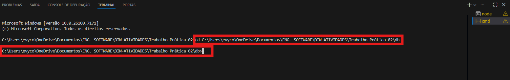
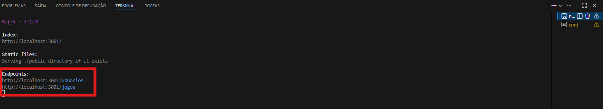
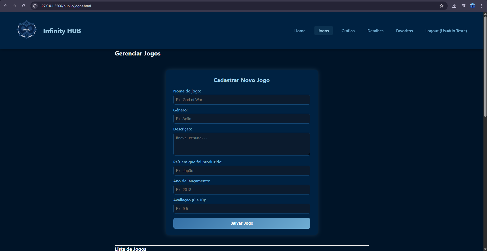

## Informações do trabalho

- Nome: Evelyn Costa
- Proposta de projeto escolhida: InfinityHUB, sistema que lista jogos de acordo com a categoria de gênero.
- Breve descrição sobre seu projeto: InfinityHUB é focado em recomendações de jogos.

## ✅ Pré-requisitos

Antes de iniciar, certifique-se de:

1. Ter o [Node.js](https://nodejs.org/) instalado em sua máquina.  
2. Estar no terminal na pasta raiz do projeto.  
   ```bash
   node -v
   Se aparecer algo como v22.9.0, o Node está pronto para uso⚙️

Passo a passo para executar o projeto:

1. Abra o projeto no terminal
    Acesse a pasta onde o projeto está salvo e acesse a pasta db.
    Exemplo:
    cd: caminho/da/sua/pasta/db
    

2. Abra o arquivo principal no navegador
    Abra o arquivo html que você está avaliando no seu navegador(basta dar duplo clique no arquivo ou abrir via VS Code com "Open with Live Server)

    ⚠️ Nesse momento o CRUD ainda não estará funcional, apenas a interface será exibida e pode apresentar erro.


3. Execute o servidor JSON
    No mesmo terminal, execute o seguinte comando:

    npx json-server --watch db.json --port 3001

    Depois de rodar, ele mostrará algo como:    
        Index:
        http://localhost:3001/
    

4. Volte para a página do arquivo principal e atualize
    Volte à aba onde abriu o arquivo principal e aperte F5 / Atualizar a página
    Agora o CRUD está funcional
    Exemplo:
    
    
 

## 📝 Observações

1. Todas as aplicações que utilizam JSONServer estão na porta 3001.


